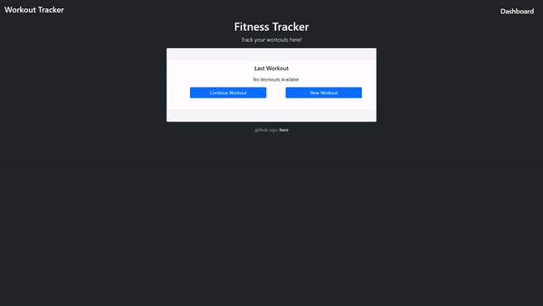

# Workout Tracker

## Table of Contents

- [Workout Tracker](#workout-tracker)
  - [Table of Contents](#table-of-contents)
  - [Description](#description)
  - [Installation](#installation)
  - [Usage](#usage)
  - [Built With](#built-with)
  - [Technologies Used](#technologies-used)
  - [Contributing](#contributing)
  - [License](#license)
  - [Questions](#questions)
  

## Description
A workout tracker that creates and tracks workouts. Utilizes a Mongo database with Mongoose schema, Express.js route handler, Node.js, HTML, CSS, Vanilla JS

  

## Installation

Any modern internet browser will do!

## Usage

[Deployed on Heroku](https://workout-tracker-henrykam.herokuapp.com/?id=6193841fe9e42e14e8abf101)

 

## Built With
* [HTML](https://developer.mozilla.org/en-US/docs/Web/HTML)
* [CSS](https://developer.mozilla.org/en-US/docs/Web/CSS)
* [JavaScript](https://developer.mozilla.org/en-US/docs/Web/JavaScript)
* [Node.js](https://nodejs.org/en/)
* [Express.js](https://expressjs.com/)
* [MongoDB](https://www.mongodb.com/)
* [Mongoose](https://www.npmjs.com/package/mongoose)

## Technologies Used
* [Microsoft Visual Studio Code](https://code.visualstudio.com/)
* [Git Bash](https://git-scm.com/downloads)
* [GitHub](https://github.com/)
* [Insomnia](https://insomnia.rest/)
* [Heroku](https://www.heroku.com/)
* [Robo 3T](https://robomongo.org/)

## Contributing

**Henry Kam**

- [Github](https://github.com/gulpinhenry)
- [LinkedIn](https://www.linkedin.com/in/kamhenry/)

## License

This application is covered under the MIT license

## Questions

For any questions, please reach out by creating an issue.
